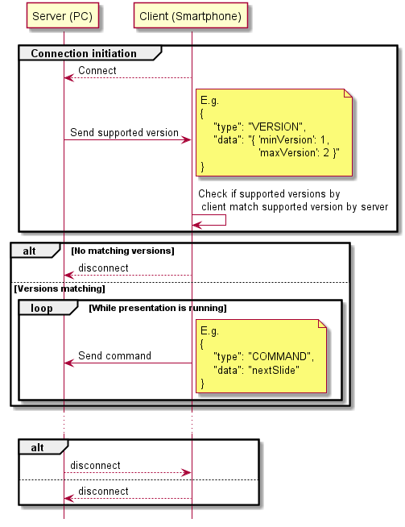

# Presenter Protocol Definition Version 1 - Draft
This document contains the definition of the presenter protocol.  
The basic idea is to define a simple protocol and allow all servers that
support a specific version of the protocol version to be remote
controlled by any client supporting matching versions.  
E.g. you can remote control a presentation running on a pc using your
smartphone over bluetooth connection using this presenter protocol.

## Table of contents
- [Latest version of the document](#latest-version-of-the-document)
- [Copyright notice](#copyright-notice)
- [Conventions used in this document](#conventions-used-in-this-document)
- [Presenter protocol definition](#presenter-protocol-definition)
    - [General](#general)
    - [Connection initiation](#connection-initiation)
    - [Command definition](#command-definition)
- [Examples](#examples)
    - [Version messages](#version-messages)
    - [Command messages](#command-messages)
    - [Command flow](#command-flow)
- [References](#references)
- [Changes](#changes)

## Latest version of the document
The latest release of this document can be found on github at the 
following url: https://github.com/FelixWohlfrom/Presenter-Protocol/releases

## Copyright notice
Copyright © 2018 Felix Wohlfrom. All rights reserved except the following:  
You are allowed to to share and translate this document for free. You are
also allowed to convert this markdown file for displaying purpose e.g.
to html, pdf or other output formats. In all cases, a link to the original
file needs to be present (see [latest version of the document](#latest-version-of-the-document)).

All modifications and distribution to this markdown file are forbidden,
except if they are sent as a [pull request](#https://github.com/FelixWohlfrom/Presenter-Protocol/pulls)
via github that needs to be accepted by the repository admin.

## Conventions used in this document
   The key words "MUST", "MUST NOT", "REQUIRED", "SHALL", "SHALL NOT",
   "SHOULD", "SHOULD NOT", "RECOMMENDED", "MAY", and "OPTIONAL" in this
   document are to be interpreted as described in [[RFC2119](#rfc2119)].

## Presenter protocol definition
The definition contains three major parts: A general introduction, a 
description of the connection initiation and the definition of the
commands that are supported by the protocol.

### General
Here you find some general definitions that MUST be supported by both
client and server if they implement this presenter protocol.
 
1. Data transmission
    1. All data transmitted between the server and the client MUST be
       transmitted using the JSON protocol as in rfc 8259 [[JSON](#json)].
    1. In particular, as noted in rfc 8259, the transmission MUST be
       UTF-8 encoded.
1. Message structure  
    All transmitted data between the server and the client MUST be
    packed into so called *messages*.  
    These *messages* MUST be structured as the following json encoded
    text:

    ```
    {
        "type": <msg_type>,
        "data": <msg_data>
    }
    ```

    The following values MUST be supported for *&lt;msg_type&gt;*:  
    VERSION  
    COMMAND  
    
    The *&lt;msg_data&gt;* is a string. The content of the string depends on
    the *&lt;msg_type&gt;* and is now described in detail:

    1. <a name="msg_version">*&lt;msg_type&gt;* VERSION  
        The *&lt;msg_data&gt;* MUST be a json string having the following
        structure:

        ```
        {
            "minVersion": <min_version>,
            "maxVersion": <max_version>
        }
        ```
        
        *&lt;min_version&gt;* MUST contain the minimum version of commands
        that is supported by the current connection.  
        
        *&lt;max_version&gt;* MUST contain the maximum version of commands
        that is supported by the current connection.
        
        The server or client MUST support all commands that are
        defined for the range between *&lt;min_version&gt;* and 
        *&lt;max_version&gt;*, including both boundary values.

    1. <a name="msg_command" />*&lt;msg_type&gt;* COMMAND  
        The *&lt;msg_data&gt;* MUST be a simple string. Valid values for 
        the commands are defined in the chapter 
        "[Command definition](#command-definition)".


### Connection initiation
Once the first client established a connection to the server, the server
MUST response with a [*&lt;msg_type&gt;* VERSION](#msg_version) message.

The client SHOULD now check if the command versions supported by the
server and the command versions supported by the client match. If the
range of versions supported by the server and the versions supported by
the client don't match, the client SHOULD disconnect from the server.

Once the connection is established, the client can send the following
commands to the server.

### Command definition
The following table describes the commands that can be sent using the
[*&lt;msg_type&gt;* COMMAND](#msg_command).  
The "*Command*" row contains the command, that is sent in the 
*&lt;msg_data&gt;* field.  
The "*Min Version*" row contains the minimum protocol version that MUST
be supported by both server and client to transmit the command.  
The "*Max Version*" row contains the maximum protocol version that MUST
be supported by both server and client to transmit the command. The 
maximum value for this row MAY be updated in newer releases of the
presenter protocol.  
The "*Description*" row contains a description of the action the server
MUST execute once it receives the command.

| Command | Min Version | Max Version | Description |
| ------- | ----------- | ----------- | ----------- |
| prevSlide | 1 | 1 | Switch to the previous slide of the presentation |
| nextSlide | 1 | 1 | Switch to the next slide of the presentation |

## Examples
In this chapter there are several examples of json messages and an
example command flow which shows the commands that are sent between
client and server.

### Version messages
In this message, the server notifies the client that it supports all
commands from command version 1 up to command version 3. This means that
the server supports commands version 1, 2 and 3:

```
{
    "type": "VERSION",
    "data": "{ \"minVersion\": 1, \"maxVersion\": 3 }"
}
```

This message notifies the client, that only command version 2 and
commands version 3 are supported by the server:

```
{
    "type": "VERSION",
    "data": "{ 'minVersion': 2, 'maxVersion': 3 }"
}
```

### Command messages
This command message is sent from the client to the server to request
a switch to the previous slide of a currently running presentation:

```
{
    "type": "COMMAND",
    "data": "prevSlide"
}
```

This command message is sent from the client to the server to continue
the presentation on the next slide:

```
{
    "type": "COMMAND",
    "data": "nextSlide"
}
```

### Command flow
This diagram displays a common information flow between a server and
a client.  
The server is running on a pc, on which the presentation is
running. The client is installed on a smartphone and will remote control
the presentation.

The client initiates a connection. Then the server sends the supported
command versions  to the client. Afterwards, the client checks if the 
versions supported by the client and the versions by the server have a
common range of supported versions.

If there is no match between the supported versions, the client
disconnects from the server.

If there is a matching version range, the client will send regularly
command messages to the server.

Finally, both server and client can close the connection.

This flow is shown in the following figure.



## References
*<a name="rfc2119" />[RFC2119]* - Bradner, S., "Key words for use in RFCs to Indicate Requirement Levels", BCP 14, RFC 2119, DOI 10.17487/RFC2119, March 1997, <https://www.rfc-editor.org/info/rfc2119>.  
*<a name="json" />[JSON]* - Bray, T., Ed., "The JavaScript Object Notation (JSON) Data Interchange Format", STD 90, RFC 8259, DOI 10.17487/RFC8259, December 2017, <https://www.rfc-editor.org/info/rfc8259>.

## Changes
In this chapter you can find the changes that where done in the 
different releases of the presenter protocol definition. 

| Version | Changes |
| ------- | ------- |
|   1 - Draft   | Initial version of this document |